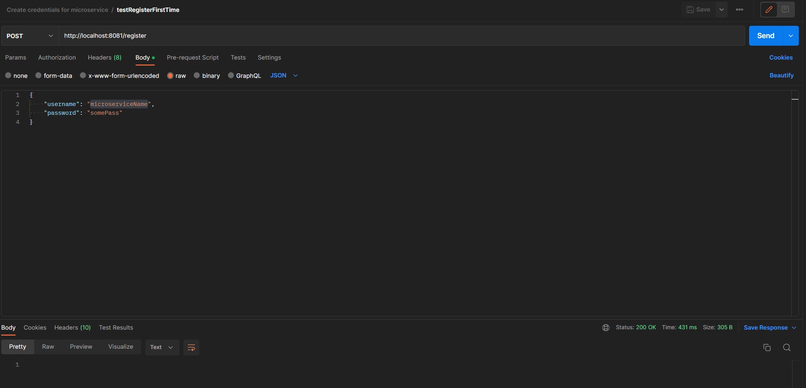
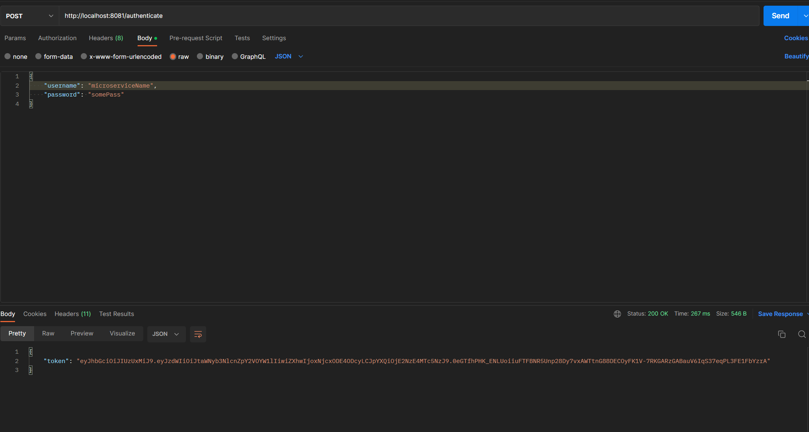

# Rowing Matching Application(Group 33b SEM Project)

This is group's 33b Software Engineering Methods lab project\
Scenario: ROWING\

This project contains the following microservices:\
-[activity](activity-microservice/README.md)\
-[authentication](authentication-microservice/README.md)\
-[notification](notification-microservice/README.md)\
-[user](user-microservice/README.md)

Inside each of the microservice's readmes there are intructions on how to run and configure

# Creating credentials for a microservice

1. Run the Authentication microservice(you can use the guide [here](authentication-microservice/README.md) to configure and run it).
2. Import [this](postmanRequestCollections/Create_credentials_for_microservice.postman_collection.json) configuration into Postman as a collection.
3. Replace in the body of the requests 'microserviceName' with the name of the microservice(notification for notification-microservice and activity for activity-microservice).
4. Alternatively to Postman you can check out the following pictures depicting the POST requests needed to be performed.

5. Set the token received to the value 'microserviceJWT' inside the microservice's application.properties