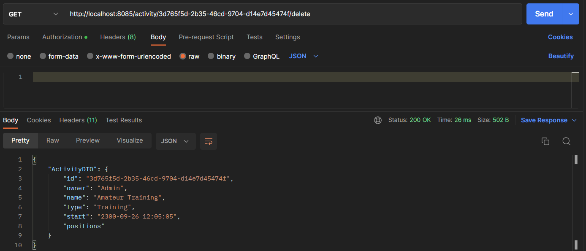
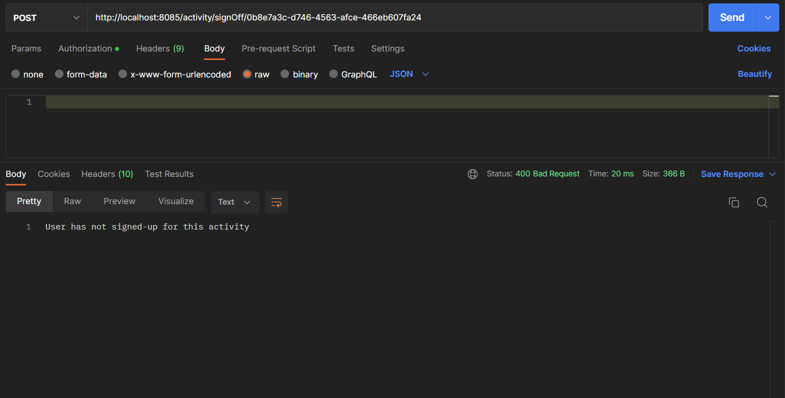
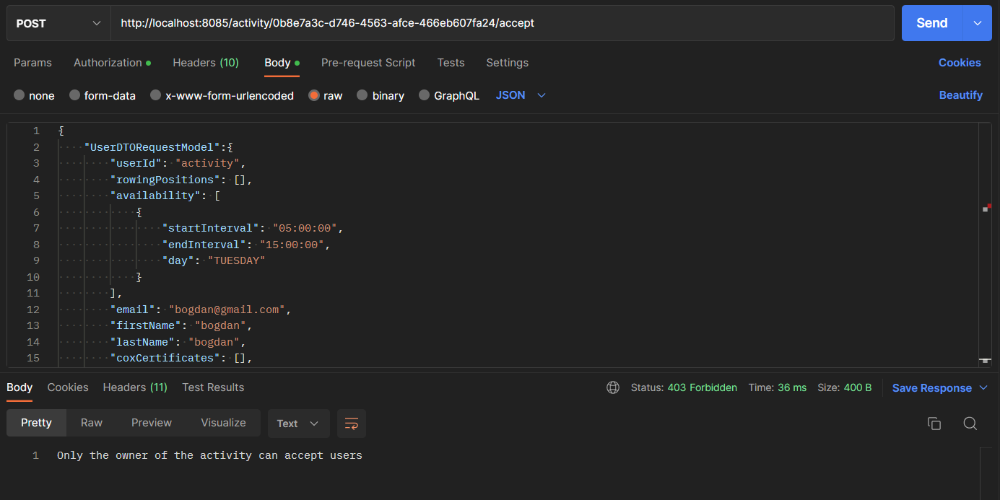
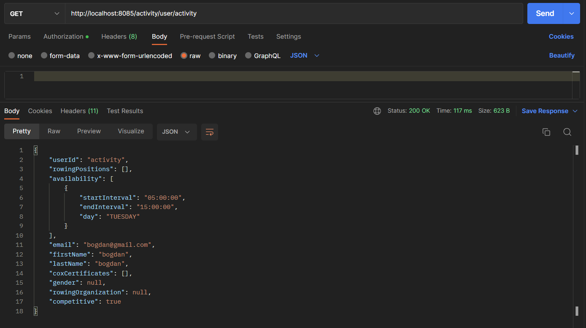

# Activity microservice
This microservice is responsible for handling, storing and operating on information about the activities and also matching between users and activities.

It has 4 entities:
-3 of them(Activity, Competition and Training) are used for organising the structure of the activity and preserving the modular property
-The 4th(Matching) handles connecting users to different activities and keeping information in the repository.

## Running the microservices

Right click on Application.java in [this](src/main/java/rowing/activity) folder.\
Alternatively you can run it from the terminal:
1. Go to the [root](..) folder.
2. Run <b>gradle notification-microservice:build</b>
3. Run <b>gradle notification-microservice:bootRun</b> 

Then, you can use *Postman* to perform the different requests.

To use the endpoints that this microservice provides, the `authentication` microservice should be running and the user should have an account as well as be authenticated. To create credentials please go [here](../authentication-microservice/README.md) to find out how to do it.

# Endpoints
- the port of this microservice is 8085 by default
- every path of the endpoints present should have the `\activity` path before the actual path of the desired endpoint.
- `/new` - creates a new activity
- - it would return a string of the form "Activity 'idActivity' was created successfully!"
- - this is how a request and response should look like 
- - 
- `/activityList` - retrieves a list of all available activities
- - in the `body` of the request should be left empty
- - this is how a request and response looks like 
- - 
- `/{activityId}` - retrieves an activity with a specified id
- - the id of the activity should be specified in the url of the request
- - this is how a request should look like 
- - 
- `/sign/{activityId}` - signs up the user for activity calling this endpoint for the activity with id=activityId
- - returns 200 OK "User ... signed up for activity: ...!" if the user was successfully signed up, or other error code if there were any problems
- - this is how a request should look like 
- - 
- - this is how the response looks like to the request made above 
- - 
- - 
- `/signOff/{activityId}` - signs off the user from activity calling this endpoint for the activity with id=activityId
- - returns 200 OK "User ... signed off from activity: ...!" if the user was successfully signed off, or other error code if there were any problems
- - this is how a request and response should look like 
- - 
- -
- - `user/activity` - retrieves the userDTO object indirectly from the users database - not to be called by client directly, used internally
- - returns 200 OK if the availability was successfully changed, or other error code if there were any problems
- - this is how a request should look like 
- - 
- - 
- - `{activityId}/reject` - rejects a user from participating in an activity - only to be called by the owner of the activity
- - returns 200 OK if the user was rejected successfully, 403 FORBIDDEN if the request wasn't made by the owner of the activity or other error code if there were any problems
- - this is how a request should look like 
- - 
- - 
- - `{activityId}/accept` - accepts a user to participate in an activity - only to be called by the owner of the activity
- - returns 200 OK if the user was accepted successfully, 403 FORBIDDEN if the request wasn't made by the owner of the activity or other error code if there were any problems
- - this is how a request should look like 
- - 
- - 
- - `{activityId}/kick` - kicks a user who is currently participating in the activity and creates a free position - only to be called by the owner of the activity
- - returns 200 OK if the user was rejected successfully, 403 FORBIDDEN if the request wasn't made by the owner of the activity or other error code if there were any problems
- - this is how a request should look like
- - 
- -
- - `user/{userId}` - sends a username and recieves a userDTO object corresponding to that username from the user repository by communicating with the user microservice
- - returns 200 OK if the userDTO object is returned successfully, and 400 BAD REQUEST if there were any problems
- - this is how a request should look like
- - 
- - 
- - `{activityId}/participants` - retrieves the all current participants of the activity and returns a list of userDTO objects by communicating with the user microservice - only to be called by the owner of the activity
- - returns 200 OK if the participant list is returned successfully, 403 FORBIDDEN if the request wasn't made by the owner, and 400 BAD REQUEST if there were any problems
- - this is how a request should look like
- - 