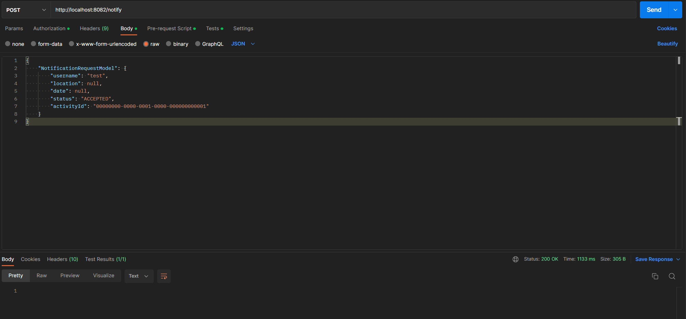
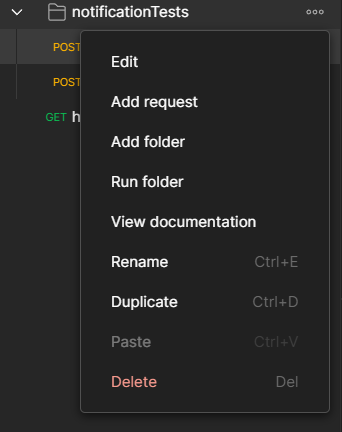
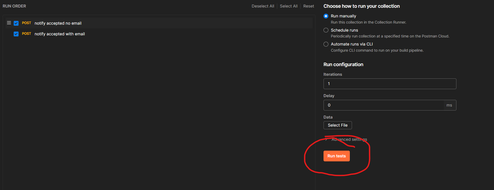

# Notification microservice
This microservice is responsible for notifying a user upon:
- acceptance
- rejection
- withdrawal
- being kicked from the activity
- the activity they were signed-up for being deleted
- the time or location of the activity being changed

# Endpoints
- POST /notify
- - the authorization header needs to contain a jwt token
- - the body needs to contain a json of the form: \
{\
    "NotificationRequestModel": {\
        "username": "test",\
        "location": null,\
        "date": null,\
        "status": "ACCEPTED",\
        "activityId": "00000000-0000-0001-0000-000000000001"\
    }\
}
- - this request should respond with 200OK and nothing in the body like in the following image

Upon receiving the needed information through a POST request at /notify this microservice then sends an email to the specified address containing the status.
Note that this endpoint is not made for client interaction, it's purpose is to receive notify requests from the other microservices and take care of notifying the user

# Configuring the microservice:
1. Open up application.properties.
2. Set "server.port" to the desired port(make sure it doesn't conflict with other services on the same port), by default it is set to 8082.
3. Set "jwt.secret" to the desired secret for encoding/decoding the JWT token.
4. Set "uri.users.url" to the address where the users microservice is deployed(by default set to http://localhost). 
5. Set "uri.users.port" to the port configured in the users microservice, by default set to 8084.
6. Set "uri.users.getemailpath" to the path configured in the users microservice controller for the get email address endpoint, by default set to "/get-email-address".
7. Set the values for the email configuration using this [guide](https://www.baeldung.com/spring-email#2-spring-boot-mail-server-properties).
8. Set up the premade body and subject of the notification by completing all the values marked with body.notification* or subject.notification.*.
9. Complete the credentials of the microservice(microserviceAuthUsername, microserviceAuthPassword and microserviceJWT), if you don't have them follow [this](../README.md) guide to create some.

# Running the microservice

Right click on Application.java in [this](src/main/java/rowing/notification) folder.\
Alternatively you can run it from the terminal:
1. Go to the [root](..) folder.
2. Run <b>gradle notification-microservice:build</b>
3. Run <b>gradle notification-microservice:bootRun</b>

# Manual system testing using Postman
1. Import [this](../manualTests/testing_notification.postman_collection.json) postman collection into postman.
2. Click on ... as shown below and then on Run folder.

3. Click on Run tests on the right side as shown below
