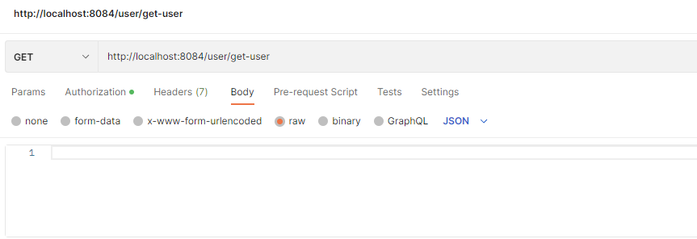
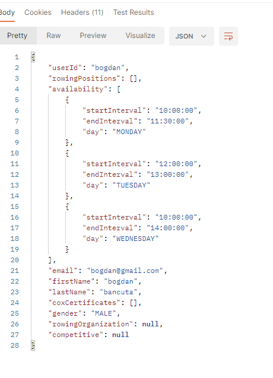
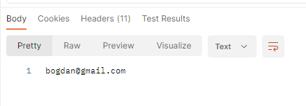
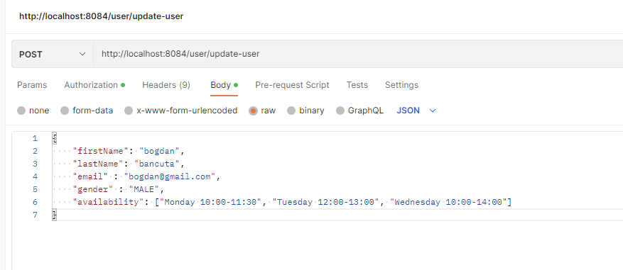
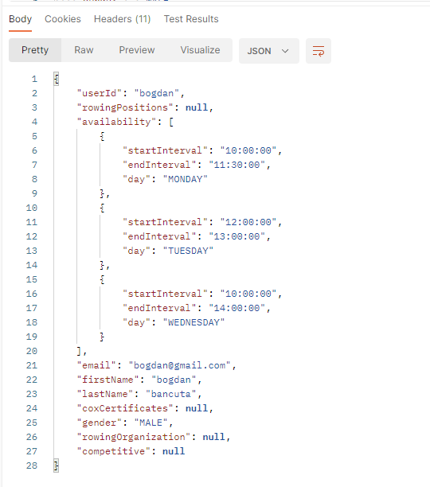
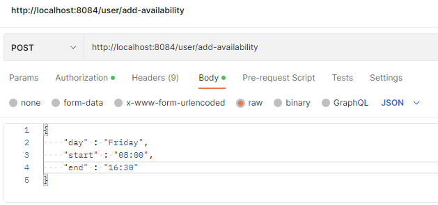
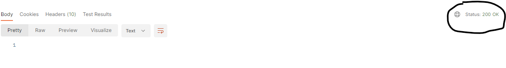
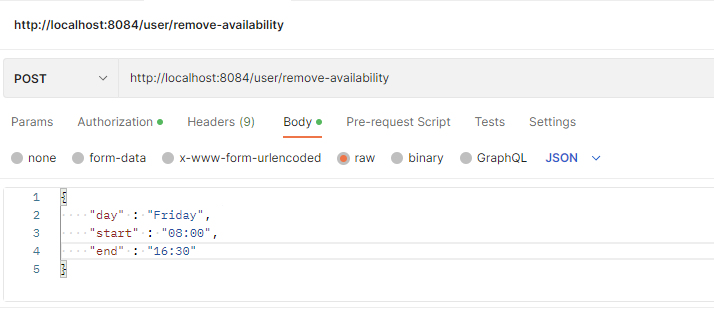
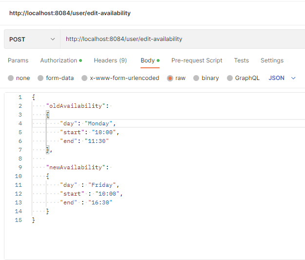
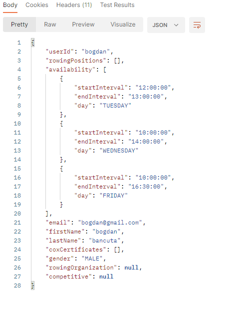

# User microservice
This microservice is responsible for handling all the personal data and profile details of a user: 
- first name
- last name
- email
- gender
- rowing organisation
- preferred positions
- intervals when a user is available for an activity
- certificates for the COX position if applicable
- whether the user wants to participate in competitions or just training activities

as well as managing the database with this information.
## Running the microservices

You can run the microservice by starting the Spring application. Then, you can use *Postman* to perform the different requests.

To use the endpoints that this microservice provides, the `authentication` microservice should be running and the user should have an account as well as be authenticated. 

# Endpoints
- the port of this microservice is 8084
- every path of the endpoints present should have the `\users` path before the actual path of the desired endpoint.
- `/get-user` - retrieves the whole profile of the user
- - it would return a userDTO which contains all the user information, doesn't work if the `update user` endpoint was not used to complete the mandatory information first
- - this is how a request should look like 
- - 
- - this is how the response looks like to the request made above 
- - 
- `/get-email-address` - retrieves the email address of the user - (mostly used to send notifications)
- - in the `body` of the request the username should be provided
- - this is how a request looks like 
- - 
- - this is how the response looks like to the request made above 
- - 
- `/update-user` - updates the user profile with the new information that is given, everything that is null would be kept as it was
- - if the user has just registered this endpoint must be used to update the mandatory information such as first name, last name and email
- - returns the updated profile of the user in the form of a UserDTO
- - this is how a request should look like 
- - 
- - this is how the response looks like to the request made above 
- - 
- `/add-availability` - adds a new interval when the user is available to participate in an activity
- returns 200 OK if the availability was successfully added, or other error code if there were any problems
- - this is how a request should look like 
- - 
- - this is how the response looks like to the request made above 
- - 
- - 
- `/remove-availability` - removes an existing interval when the user was available to participate in an activity
- - returns 200 OK if the availability was successfully removed, or other error code if there were any problems
- - this is how a request should look like 
- - 
- - this is how the response looks like to the request made above 
- - 
- 
- - `/edit-availability` - changes an existing availability interval
- - returns 200 OK if the availability was successfully changed, or other error code if there were any problems
- - this is how a request should look like 
- - 
- - this is how the response looks like to the request made above 
- - 
- - now we if we get the information of the user we can see the change 
- - 

- Upon receiving the needed information through a POST request, the (updated) user information will also be reflected in the database. 